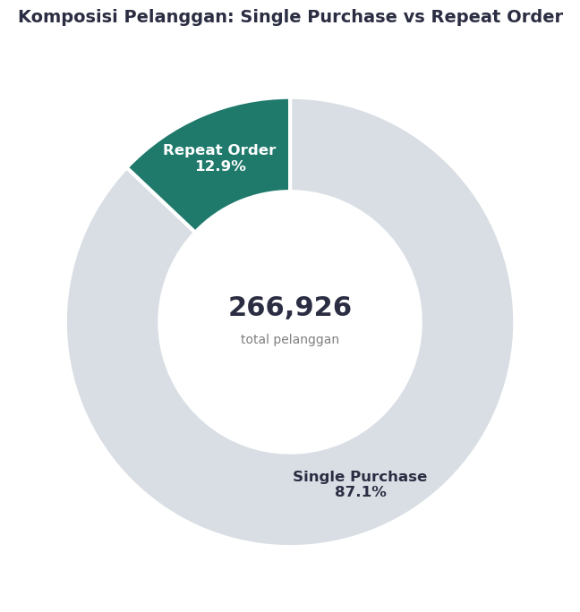
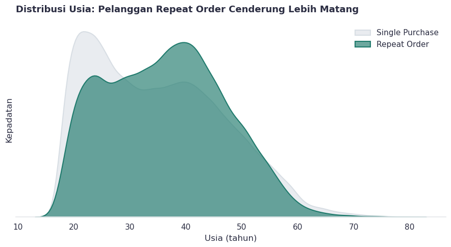
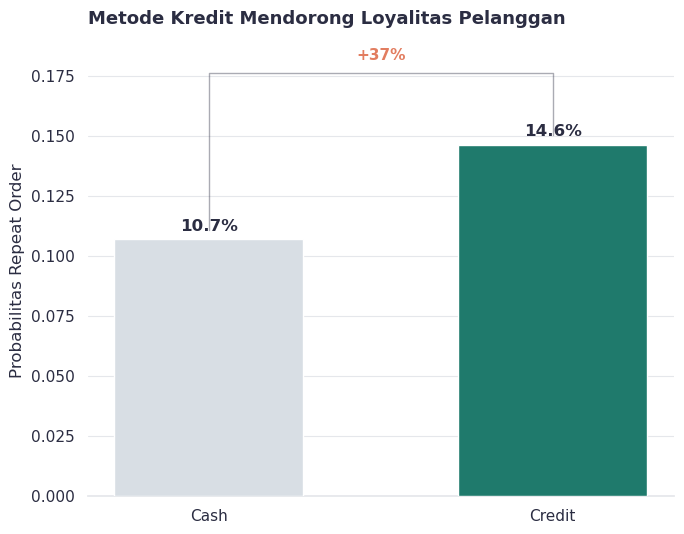
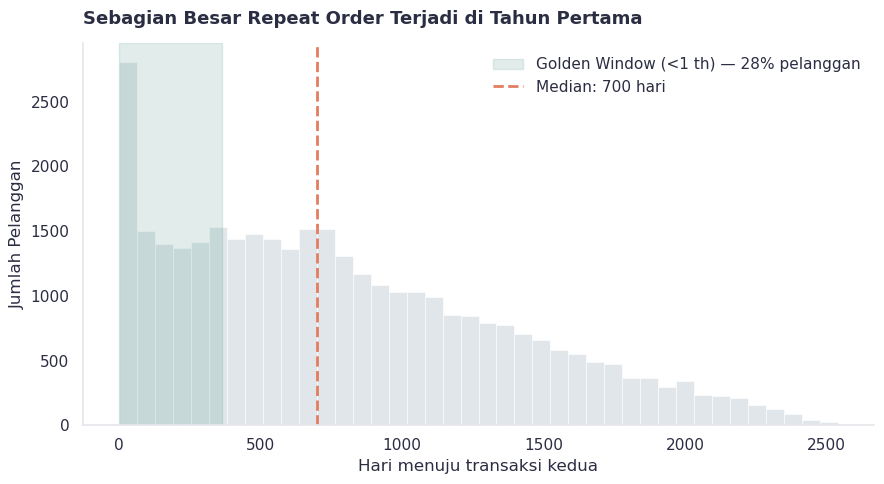
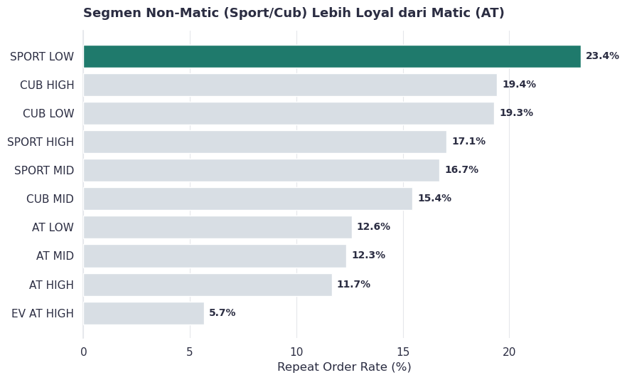
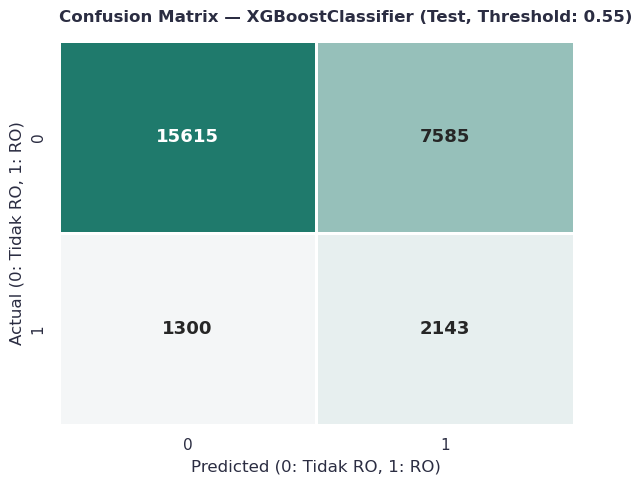
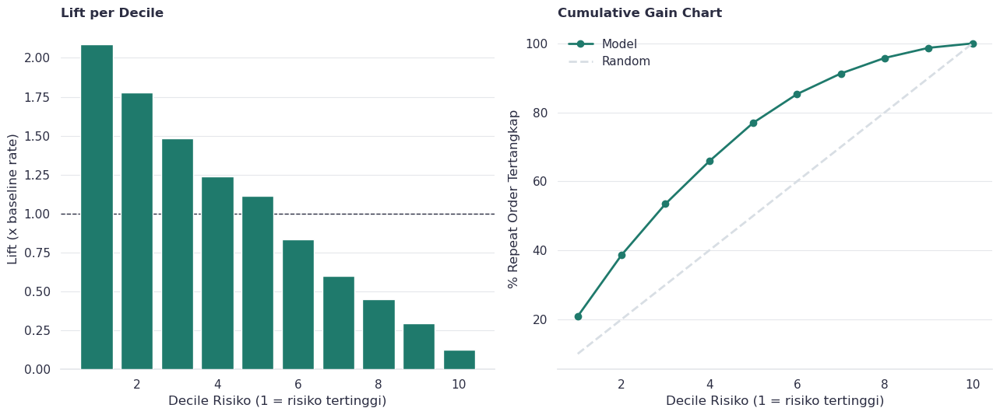

# SPARC — Prediksi Repeat Order Pelanggan Dealer Otomotif

> Analisis dan model machine learning untuk memprediksi probabilitas pelanggan melakukan pembelian ulang (repeat order) pada dealer motor, sekaligus memetakan _kapan_ dan _siapa_ yang paling layak di-follow-up oleh tim marketing.

**Dataset:** [SPARC_dataset.csv](https://raw.githubusercontent.com/micelll/SPARC-2026/main/SPARC_dataset.csv) (sumber: [repo SPARC-2026](https://github.com/micelll/SPARC-2026))

---

## 1. Problem Statement

Dealer memiliki basis pelanggan yang besar, tetapi anggaran retensi terbatas. Menghubungi semua pelanggan sama saja dengan membakar biaya kampanye ke orang-orang yang memang tidak akan kembali. Pertanyaan bisnisnya sederhana:

> Dari profil pelanggan **di hari pertama mereka bertransaksi** (usia, metode pembayaran, uang muka, tipe motor, lokasi, dsb.), seberapa besar peluang mereka akan **membeli lagi di masa depan** dan kapan?

Untuk menjawab itu, masalah dibingkai menjadi dua bagian:

- **Klasifikasi** — Akankah pelanggan melakukan repeat order? (ya/tidak)
- **Survival analysis** — Jika ya, kapan kira-kira itu terjadi? (time-to-event)

**Definisi target:**

| Label | Arti           | Definisi operasional                                                     |
| ----- | -------------- | ------------------------------------------------------------------------ |
| **1** | Repeat Order   | Pelanggan tercatat minimal **2 transaksi pada tanggal berbeda**          |
| **0** | One-Time Buyer | Pelanggan hanya bertransaksi pada **1 tanggal** dan tidak pernah kembali |

Temuan awal yang penting: dari **266.926 pelanggan**, hanya **12,9%** yang repeat order. Ini adalah masalah retensi yang serius sekaligus tantangan teknis berupa **class imbalance** yang harus ditangani dengan hati-hati.



---

## 2. Project Structure

```
1-UCSPARC-automotive-dealer-analysis/
├── README.md                          # Dokumen ini
├── Repeat-order-optimization.ipynb    # Notebook utama (analisis end-to-end)
├── SPARC_dataset.csv                  # Data mentah transaksi dealer
├── dashboard_summary.png              # Ringkasan visual dashboard
├── assets/                            # Visualisasi hasil untuk README
└── Project-Report/                    # Deliverable untuk stakeholder
    ├── Executive_Summary_Revised.docx
    ├── Laporan_SPARC_Revised.docx
    └── Repeat_Order_Prediction_Deck_Revised.pptx
```

---

## 3. Gambaran Alur Notebook

Notebook `Repeat-order-optimization.ipynb` dikerjakan sebagai satu alur analisis yang utuh, dari data mentah hingga rekomendasi bisnis:

1. **Data Preprocessing & Cleaning** — Membuang kolom kosong & baris duplikat, memisahkan kota/provinsi, menstandarkan teks kategorikal, membersihkan nilai finansial (`OTR`, `dp aktual`, `cicilan`) dari format `Rp`, memperbaiki format tanggal, dan mengoreksi anomali (umur di luar 17–80 tahun, DP > harga motor, cicilan pada transaksi tunai).

2. **Reconstruct Dataset** — Mengubah data dari level transaksi menjadi level pelanggan. Hanya informasi **hari pertama transaksi** yang dipakai sebagai fitur, dan status repeat order dijadikan label. Ini krusial untuk **mencegah data leakage** dari transaksi masa depan.

3. **Exploratory Data Analysis (EDA)** — Analisis univariat & bivariat untuk memahami siapa yang cenderung repeat order.

4. **Statistical Testing** — Uji Chi-Square & Mann-Whitney untuk memvalidasi apakah pola di EDA signifikan secara statistik, bukan sekadar kebetulan.

5. **Feature Engineering** — Membuat fitur finansial (`DP_Ratio`, `Cicilan_to_OTR_Ratio`, `CLV_Proxy`), demografi (`Age_Group`, `Is_NonMatic_Segment`), dan agregasi.

6. **Feature Selection & Validation** — Membuang fitur redundan/bocor. Salah satu temuan penting: fitur `Recency_Days` **dibuang** karena terbukti leaky (lihat bagian evaluasi).

7. **Modeling (Klasifikasi)** — Melatih & tuning beberapa model boosting/ensemble, memilih yang terbaik berdasarkan validation set.

8. **Model Evaluation** — Classification report, confusion matrix, permutation importance, SHAP, serta Lift/Gain chart untuk konteks bisnis.

---

## 4. Hasil & Temuan

### 4.1 Exploratory Data Analysis

**Usia menjadi prediktor, dimana pelanggan yang lebih matang lebih loyal.**
Pelanggan usia 20-an cenderung menjadi pembeli tunggal (stabilitas ekonomi belum matang), sedangkan kelompok **36–45 tahun** menunjukkan potensi loyalitas tertinggi karena kemapanan finansial dan kebutuhan keluarga yang lebih kompleks.



**kredit mendorong loyalitas.**
Pengguna **kredit** punya probabilitas repeat order **14,65%**, jauh di atas pengguna **tunai** (**10,70%**) — selisih **+37%**. Artinya: menyiapkan dana tunai besar untuk pembelian kedua jauh lebih berat dibanding sekadar memakai kembali limit kredit yang sudah ada.



**Golden Window Time Period**
Konsentrasi tertinggi (~28%) pelanggan repeat order terjadi di **tahun pertama**. Namun median berada di ~700 hari, artinya separuh pelanggan butuh **sekitar dua tahun** untuk kembali. Implikasinya strategi follow-up perlu **dua fase**, penawaran agresif di 365 hari pertama, lalu program pemeliharaan hubungan hingga tahun kedua.



**Segmen produk non matic lebih berpotensi repeat order**
Segmen non-matic (SPORT LOW memimpin di **23,4%**, disusul CUB & SPORT lain di 15–19%) mengungguli seluruh lini matic (AT LOW/MID/HIGH) yang tertahan di ~12%. Segmen EV AT HIGH mencatat retensi terendah (5,7%).



**Temuan pendukung lain:** tenor pendek → repeat order lebih tinggi (kapasitas finansial kuat, cepat "punya ruang" untuk kredit baru); jumlah unit di hari pertama berkorelasi positif dengan loyalitas; dan tingkat retensi bervariasi signifikan antar wilayah (6,0%–15,0%) maupun antar perusahaan pembiayaan (10,3%–17,8%).

### 4.2 Statistical Testing

Semua faktor kunci diuji signifikansinya dan **seluruhnya lolos** (p-value < 0,05), mengonfirmasi bahwa pola di EDA nyata secara statistik:

| Faktor            | Uji          | P-Value  | Kesimpulan |
| ----------------- | ------------ | -------- | ---------- |
| Umur              | Mann-Whitney | 4,8e-150 | Signifikan |
| Metode pembayaran | Chi-Square   | ~0,0000  | Signifikan |
| Tenor             | Mann-Whitney | ~0,0000  | Signifikan |
| Finance Company   | Chi-Square   | ~0,0000  | Signifikan |
| Wilayah           | Chi-Square   | ~0,0000  | Signifikan |
| Jumlah Unit       | Chi-Square   | ~0,0000  | Signifikan |

meski populasi pembeli multi-unit sangat kecil, uji Chi-Square tetap signifikan. artinya dalam dataset ini perilaku beli banyak unit **bukan anomali acak**, melainkan prediktor yang kuat.

### 4.3 Modeling & Evaluation (Klasifikasi)

**Penanganan imbalance.** Dilakukan undersampling kelas mayoritas hanya di training set, validation & test dibiarkan pada proporsi asli agar evaluasi mencerminkan kondisi nyata. SMOTE sengaja dihindari agar model belajar dari pola asli, bukan data sintetis.

**Perbandingan model** (dievaluasi di validation set, dioptimalkan pada ROC-AUC):

| Model                | Val ROC-AUC | Best F1 (val) |
| -------------------- | ----------- | ------------- |
| HistGradientBoosting | 0,7141      | 0.3319        |
| GradientBoosting     | 0.7138      | 0.3318        |
| XGBoost              | 0.7139      | 0.3279        |
| RandomForest         | 0,7083      | 0.3221        |

Model terpilih: **HistGradientBoost**. Pada **test set independen**, performa akhir:

- **ROC-AUC: 0,7141**
- **Recall (kelas repeat order): 0,60**
- **Precision (kelas repeat order): 0,23**

model dioptimalkan untuk **recall tinggi**. Untuk kasus retensi, "melewatkan" pelanggan loyal (false negative) jauh lebih mahal daripada "salah sasar" (false positive). Konsekuensinya presisi turun ke 22% dimana artinya tim akan menghubungi sejumlah pelanggan yang ternyata tidak kembali, tetapi itu trade-off yang disengaja demi tidak kehilangan peluang emas.



### 4.5 Lift Gain Analysis

model memberi **skor probabilitas repeat order** ke tiap pelanggan, lalu semua pelanggan **diurutkan dari skor tertinggi ke terendah** dan dibagi menjadi 10 kelompok sama besar (_decile_). Decile 1 = 10% pelanggan yang menurut model paling mungkin kembali sementara Decile 10 = paling tidak mungkin. Pertanyaan bisnisnya: _"kalau budget hanya cukup menghubungi sebagian pelanggan, siapa yang didahulukan?"_ Chart ini menjawabnya



- **Hubungi 20% pelanggan teratas (Decile 1–2) → dapat 38,7% dari semua repeat order.** Artinya cukup menyentuh 1 dari 5 pelanggan, tim sudah menjaring hampir 4 dari 10 pelanggan yang benar-benar akan kembali.
- **Lift 2,08x** membandingkan hasil ini dengan menebak acak. Kalau 20% pelanggan dipilih acak, wajarnya hanya dapat ~20% repeat order; dengan model hasilnya 38,7% — **2,08 kali lebih banyak** untuk usaha yang sama. Jadi _lift_ = seberapa kali lipat model mengalahkan tebakan buta.
- **Hubungi 50% pelanggan teratas (Decile 1–5) → dapat ~77% dari semua repeat order.** Sisa 50% pelanggan (Decile 6–10) hanya menyumbang ~23% target, sehingga tidak efisien untuk dikejar.

anggaran kampanye bisa dipangkas drastis dengan cara menargetkan segmen berskor tinggi, cara ini juga bisa dilakukan tanpa kehilangan banyak peluang, karena pelanggan yang dilewati memang kecil kemungkinannya repeat order.

**Nilai bisnis model — Lift & Gain.**
Ini bagian yang paling relevan untuk marketing. Dengan mengurutkan pelanggan berdasarkan skor model:

- Menyasar **20% teratas** (Decile 1–2) menangkap **38,7%** dari seluruh repeat order → **lift hingga 2,08x** dibanding acak.
- Menyasar **50% teratas** (Decile 1–5) menjangkau **~77%** target.

Artinya anggaran kampanye bisa dipangkas drastis sambil tetap menjangkau mayoritas pelanggan potensial.

---

## 5. Kesimpulan

- **Retensi rendah tapi terprediksi.** Hanya 12,9% pelanggan yang repeat order, namun perilaku ini punya pola yang jelas dan tervalidasi secara statistik.
- **Profil pelanggan loyal:** usia matang (36–45), memakai **kredit**, mengambil **tenor pendek**, membeli motor **non-matic**, dengan **DP/cicilan relatif besar** terhadap harga (kapasitas finansial kuat), dan cenderung membeli lebih dari satu unit di awal.
- **Model layak dipakai untuk targeting.** Meski presisi absolut rendah (wajar untuk data imbalance), nilai bisnisnya kuat: **lift 2x** di dua desil teratas dan **77% target tertangkap dari 50% populasi**.
- **Waktu itu penting.** Kombinasi klasifikasi (_siapa_) + survival analysis (_kapan_) memberi gambaran lengkap untuk merancang kampanye retensi.

---

## 6. Rekomendasi

1. **Prioritaskan anggaran retensi ke Decile 1–4** hasil skor model, bukan seluruh basis pelanggan — cara paling efisien memaksimalkan ROI kampanye.
2. **Terapkan follow-up dua fase:** penawaran agresif di **365 hari pertama** (golden window) untuk konversi cepat, lalu program _nurturing_ berkala hingga tahun kedua untuk menangkap pelanggan yang butuh waktu lebih lama.
3. **Dorong skema kredit & tenor pendek** yang sehat, karena keduanya konsisten berasosiasi dengan loyalitas lebih tinggi.
4. **Sesuaikan pesan per segmen:** manfaatkan loyalitas alami segmen non-matic; untuk wilayah/finance company dengan retensi rendah (mis. wilayah 6503 & 6472), evaluasi kualitas program pasca-penjualan, bukan sekadar kemudahan akuisisi.
5. **Pantau data leakage sebagai standar.** Pembuangan `Recency_Days` menegaskan pentingnya memisahkan sinyal perilaku asli dari artefak durasi observasi sebelum model dibawa ke produksi.

---
